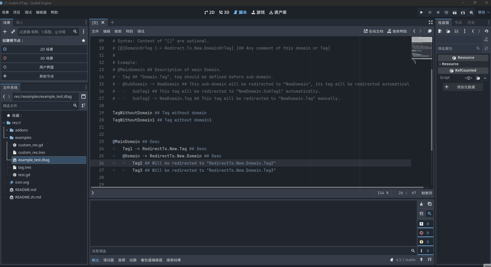
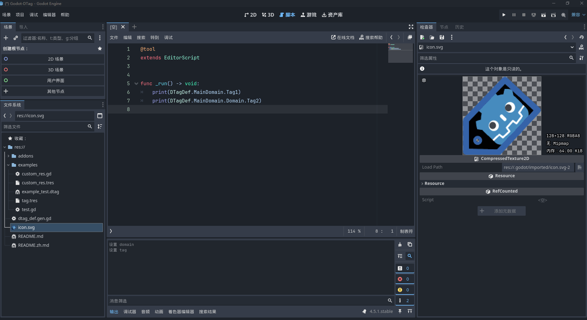
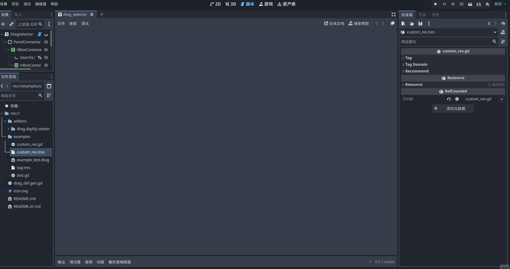
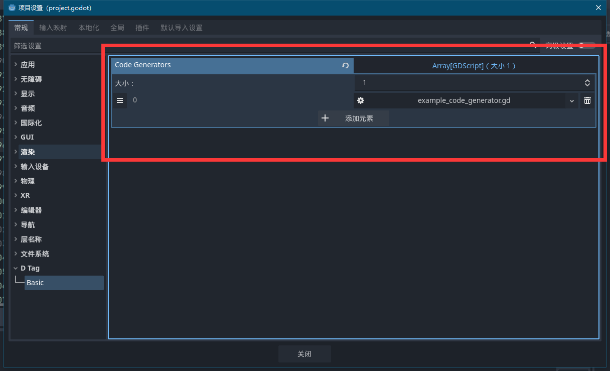

# Godot - DTag

[点击此处查看中文自述文件](README.zh.md)。


Godot-DTag provides a Tag mechanism similar to Unreal Engine's GameplayTag for Godot.

### Note: This project is still under development and may undergo significant changes in the future

## Features

- The essence of DTag is `StringName`.
- Defined through text files (with ".dtag" extension), providing syntax highlighting and syntax checking in Godot's script editor.
- Provides editor tools to generate definition scripts, and supports custom code generators to generate definition code for different languages (such as C#).
- Provides inspector plugins for selecting **Tag** or **Tag Domain** (Note: Tag Domain is similar to the concept of namespace. Since "namespace" is already a keyword in GDScript, "domain" is used as an equivalent concept).
- Allow separate tag definitions of the same domain in different ".dtag" files.
- Supports redirection of **Tag** or **Tag Domain**, no need to modify old code to point to new targets.

## Installation

This plugin is entirely implemented in GDScript. You can add it to your project like a regular plugin and enable the "Godot - DTag" plugin in the project setting.

## How to Use (Basic)



### Step1: Define Your Tags

All text files with ".dtag" extension will be recognized as DTag definition files, except those in the "res://addons/" directory or files starting with ".".

The syntax of ".dtag" are very simple:

- Use "@" as the prefix for tag Domain.
- Use tabs to define hierarchy.
- Use "->" for redirection.
- Use "#" for comments.
- Use "##" for comments on specific domains or tags.
- Tags and Tag Domains must be valid identifiers.

The specific syntax order for each line is as follows ([] indicates optional content)

```
[@]DomainOrTag [-> Redirect.To.New.DomainOrTag] [## Any comment of this domain or Tag]
```

Don't worry if you're not familiar with the syntax. When editing ".dtag" files in Godot's script editor, it will parse and provide error messages, so you can get started quickly.

Example:

```
# res://example/example.dtag
# Use "@" as the prefix for tag Domain.
# Use tabs to define hierarchy.
# Use "->" for redirection.
# Use "#" for comments.
# Use "##" for comments on specific domains or tags.
# Tags and Tag Domains must be valid identifiers.
#
# Syntax: Content of "[]" are optional.
# [@]DomainOrTag [-> Redirect.To.New.DomainOrTag] [## Any comment of this domain or Tag]
#
# Example:
# @MainDomain ## Description of main Domain.
#  Tag ## "Domain.Tag", tag should be defined before sub-domain.
#  @SubDomain -> NewDomain ## This sub-domain will be redirected to "NewDomain", its tag will be redirected automatically.
#   SubTag1 ## This tag will be redirected to "NewDomain.SubTag1" automatically.
#   SubTag2 -> NewDomain.Tag ## This tag will be redirected to "NewDomain.Tag" manually.

TagWithoutDomain ## Tag without domain
TagWithoutDomain1 ## Tag without domain1


@MainDomain ## Desc
 Tag1 -> RedirectTo.New.Tag ## Desc
 @Domain -> RedirectTo.New.Domain ## Desc
  Tag2 ## Will be redirected to "RedirectTo.New.Domain.Tag2"
  Tag3 ## Will be redirected to "RedirectTo.New.Domain.Tag3"


@RedirectTo ## Sample redirect domain.
 @New
  Tag
  @Domain
   Tag1
   Tag2
   Tag3

```

### Step2: Generate Tag Definition

Use "Project -> Tools -> Generate dtag_def.gen.gd" to generate Tag definition code. The GDScript used file "res://dtag_def.gen.gd" will be generated by default, as a dependency of editor tools.

This is the script generated from the "example.dtag" in step1.

```GDScript
# res://dtag_def.gen.gd
# NOTE: This file is generated, any modify maybe discard.
class_name DTagDef


## Tag without domain
const TagWithoutDomain = &"TagWithoutDomain"

## Tag without domain1
const TagWithoutDomain1 = &"TagWithoutDomain1"

## Desc
@abstract class MainDomain extends Object:
 ## StringName of this domain.
 const DOMAIN_NAME = &"MainDomain"
 ## Desc
 const Tag1 = &"RedirectTo.New.Tag"

 ## Desc
 @abstract class Domain extends Object:
  ## StringName of this domain.
  const DOMAIN_NAME = &"RedirectTo.New.Domain"
  ## Will be redirected to "RedirectTo.New.Domain.Tag2"
  const Tag2 = &"RedirectTo.New.Domain.Tag2"
  ## Will be redirected to "RedirectTo.New.Domain.Tag3"
  const Tag3 = &"RedirectTo.New.Domain.Tag3"


## Sample redirect domain.
@abstract class RedirectTo extends Object:
 ## StringName of this domain.
 const DOMAIN_NAME = &"RedirectTo"

 @abstract class New extends Object:
  ## StringName of this domain.
  const DOMAIN_NAME = &"RedirectTo.New"
  const Tag = &"RedirectTo.New.Tag"

  @abstract class Domain extends Object:
   ## StringName of this domain.
   const DOMAIN_NAME = &"RedirectTo.New.Domain"
   const Tag1 = &"RedirectTo.New.Domain.Tag1"
   const Tag2 = &"RedirectTo.New.Domain.Tag2"
   const Tag3 = &"RedirectTo.New.Domain.Tag3"


# ===== Redirect map. =====
const _REDIRECT_MAP: Dictionary[StringName, StringName] = {
 &"MainDomain.Tag1" : &"RedirectTo.New.Tag",
 &"MainDomain.Domain" : &"RedirectTo.New.Domain",
 &"MainDomain.Domain.Tag2" : &"RedirectTo.New.Domain.Tag2",
 &"MainDomain.Domain.Tag3" : &"RedirectTo.New.Domain.Tag3",
}

```

### Step3: Now You Can Use It Directly

Now you can use them directly through `DTagDef`.

```

func example() -> void:
 print(DTagDef.MainDomain.Tag1)
 print(DTagDef.MainDomain.Domain.Tag2)

```

## How to Use (Advanced)

This plugin provides editor plugins that use a special selector to choose Tags or Tag Domains in the inspector.

### 1. Using `DTag` resource



`DTag` has `value/tag` ("tag" is an alias for "value" in the inspector) and `domain` properties, and can redirect automatically in runtime.

### 2. Using special hint_string with custom properties



- **DTagEdit**: A hint_string that recognizes `StringName`/`String` as Tags.

 	- Basic usage with `StringName`/`String` properties:

  ```GDScript
  # This can select any tag in inspector.
  @export_custom(PROPERTY_HINT_NONE, "DTagEdit") var tag1: StringName
  ```

 	- Can limit selectable Tag Domains with hint_string like "DTagEdit: MainDomain1.Domain1":

  ``` GDScript
  # This will limit domain in "MainDomain1.Domain1":
  @export_custom(PROPERTY_HINT_NONE, "DTagEdit: MainDomain1.Domain1") var tag2: StringName
  ```

 	- Can also work with `Array[StringName]`/`Array[String]` type properties, recognizing array elements as Tags in inspector:

  ``` GDScript
  # This will recognize each element as tag in inspector.
  @export_custom(PROPERTY_HINT_TYPE_STRING, "%s:DTagEditor" % TYPE_STRING_NAME) var tag_list: Array[StringName]
  ```

- **DTagDomainEdit**: A hint_string that recognizes `StringName/String/Array/Array[StringName]/Array[String]/PackedStringName` type properties as Tag Domains.

 	- Basic usage with `StringName/String/Array/Array[StringName]/Array[String]/PackedStringName`:

  ```GDScript
  # This can select any domain in inspector.
  @export_custom(PROPERTY_HINT_NONE, "DTagDomainEdit") var tag_domain: Array[StringName]
  ```

 	- Works with `Array[Array]`/`Array[PackedStringArray]` type properties, recognizing array elements as Tag Domains in inspector:

  ```GDScript
  # This will recognize each element as tag domain in inspector.
  @export_custom(PROPERTY_HINT_TYPE_STRING, "%s:DTagDomainEditor" % TYPE_PACKED_STRING_ARRAY) var domain_list :Array[PackedStringArray]
  ```

#### You can refer to "res://addons/dtag.daylily-zeleen/examples" for more details

### 3. For incoming StringName, use `DTag.redirect()` to ensure redirection to the latest target

> **NOTE: Typical usage scenario is when using exported DTag properties to ensure they redirect to the latest target.**

```GDScript
@tool # To enabled redirect in editor (optional).

@export_custom(PROPERTY_HINT_NONE, "DTagEdit") var tag: StringName
## Redirect automatically when set.
@export_custom(PROPERTY_HINT_NONE, "DTagEdit") var tag_redirect: StringName:
 set(v):
  tag_redirect = DTag.redirect(v)

......
 # Redirect when you need.
 var redirected_target := DTag.redirect(tag)
......
```

### 4. Adding Custom Code Generators



You can add custom code generators through the "DTag/basic/code_generators" option in project settings, such as generating C# definition scripts for DTag.
Custom code generators must be marked as tool scripts and have a generation function with the signature `func generate(parse_result: Dictionary[String, RefCounted], redirect_map: Dictionary[String, String]) -> String`, returning the generated file path.

Example: (Only print the keys of the parse result as a demonstration. Please refer to "res://addons/dtag.daylily-zeleen/generater/gen_dtag_def_gdscript.gd" for more details)

```GDScript
# res://example/example_generator.gd
@tool # Tool annotation is required

func generate(parse_result: Dictionary[String, RefCounted], redirect_map: Dictionary[String, String]) -> String:
 for k in parse_result:
  print(k)

 return ""
```
